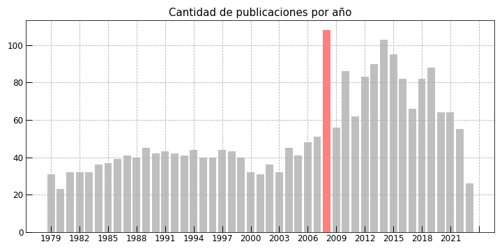
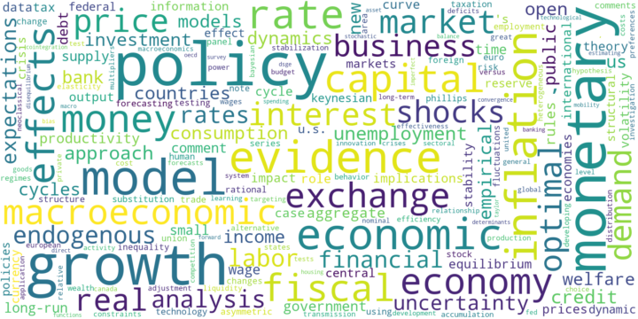

# Web Scraping al Journal of Macroeconomics
Extracción y visualización de los datos de todas las publicaciones en el Journal of Macroeconomics. Se obtuvieron links, años, nombres de autores, papers y volumenes mediante las librerías [bs4](https://pypi.org/project/bs4/) y [selenium](https://www.selenium.dev/).

Las principales conclusiones son las siguientes:
1. La tendencia de las publicaciones se mantuvo alrededor de una media de 40 artículos por año desde el año 1979 a 2007. En 2008 hubo la mayor cantidad de publicaciones: 109. Tras dicho año, la media se elevó a aproximadamente 80 artículos por año.
2. Las palabras más usadas dentro de los títulos son ‘policy’ (345), ‘growth’ (306), ‘monetary’ (296). Las palabras ‘policy’ y ‘monetary’ mantuvieron una media de 4 y 3, respectivamente, hasta los años 2003. En el 2004, se presentó un aumento muy acelerado del uso de estas palabras. Este resultado puede ser atribuido a la adopción de políticas de metas de inflación que varios países durante dichos años. A partir de dicho año, la tendencia fue creciente durante el 2005 al 2016, y luego comenzó a decaer.
3. Los autores con más publicaciones son Apostolos Serletis y Pierre-Richard Agénor con 15 y 10 artículos, respectivamente. Serletis es un economista y profesor griego nacido en 1954. Agénor, por su parte, es profesor en la Universidad de Manchester aunque antes trabajó en el Banco Mundial y el Fondo Monetario Internacional.

## Figuras

  

  

## Palabras más usadas en títulos

  

