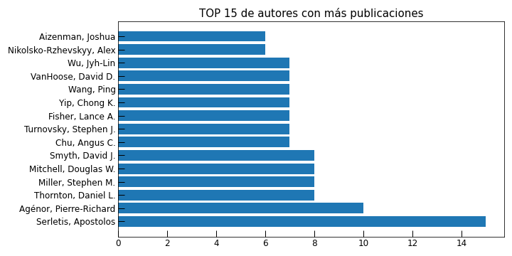

# Web Scraping al Journal of Macroeconomics
Extracción y visualización de los datos de todas las publicaciones en el Journal of Macroeconomics.

  

  

  

Se extraerá links, años, nombres de autores, papers y volumenes. Se usará las librerías `bs4`, `selenium`, `pandas`.
